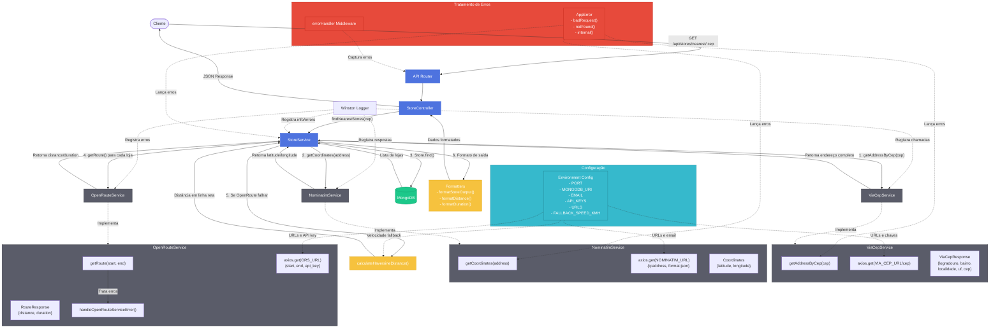

```mermaid
flowchart TB
    %% Cliente e entrada da aplicação
    Client([Cliente]) -->|"GET /api/stores/nearest/:cep"| Router["API Router"]
    Router --> Controller["StoreController"]
    
    %% Configuração
    subgraph Config ["Configuração"]
        EnvConfig["Environment Config
        - PORT
        - MONGODB_URI
        - EMAIL
        - API_KEYS
        - URLS
        - FALLBACK_SPEED_KMH"]
    end
    
    %% Controlador e Serviço Principal
    Controller -->|"findNearestStores(cep)"| Service["StoreService"]
    
    %% Conexões do logger
    Logger["Winston Logger"] -.->|"Registra info/errors"| Service
    Logger -.->|"Registra chamadas"| ViaCep
    Logger -.->|"Registra respostas"| Nominatim
    Logger -.->|"Registra erros"| OpenRoute
    
    %% Serviços externos
    Service -->|"1. getAddressByCep(cep)"| ViaCep["ViaCepService"]
    ViaCep -->|"Retorna endereço completo"| Service
    
    Service -->|"2. getCoordinates(address)"| Nominatim["NominatimService"]
    Nominatim -->|"Retorna latitude/longitude"| Service
    
    Service -->|"4. getRoute() para cada loja"| OpenRoute["OpenRouteService"]
    OpenRoute -->|"Retorna distance/duration"| Service
    
    %% Detalhes internos dos serviços
    subgraph ViaCepDetails ["ViaCepService"]
        direction TB
        ViaCepInternal["getAddressByCep(cep)"]
        ViaCepReq["axios.get(VIA_CEP_URL/cep)"]
        ViaCepRes["ViaCepResponse
        {logradouro, bairro, 
        localidade, uf, cep}"]
    end
    
    subgraph NominatimDetails ["NominatimService"]
        direction TB
        NominatimInternal["getCoordinates(address)"]
        NominatimReq["axios.get(NOMINATIM_URL)
        {q:address, format:json}"]
        NominatimRes["Coordinates
        {latitude, longitude}"]
    end
    
    subgraph OpenRouteDetails ["OpenRouteService"]
        direction TB
        OpenRouteInternal["getRoute(start, end)"]
        OpenRouteReq["axios.get(ORS_URL)
        {start, end, api_key}"]
        OpenRouteRes["RouteResponse
        {distance, duration}"]
        HandleError["handleOpenRouteServiceError()"]
        OpenRouteInternal -->|"Trata erros"| HandleError
    end
    
    %% Conexões dos serviços com seus detalhes
    ViaCep -.->|"Implementa"| ViaCepDetails
    Nominatim -.->|"Implementa"| NominatimDetails
    OpenRoute -.->|"Implementa"| OpenRouteDetails
    
    %% Banco de dados
    Service -->|"3. Store.find()"| Database[(MongoDB)]
    Database -->|"Lista de lojas"| Service
    
    %% Formatação e utilidades
    Service -->|"5. Se OpenRoute falhar"| Haversine["calculateHaversineDistance()"]
    Haversine -->|"Distância em linha reta"| Service
    
    Service -->|"6. Formato de saída"| Formatter["Formatters
    - formatStoreOutput()
    - formatDistance()
    - formatDuration()"]
    
    %% Tratamento de erros
    subgraph ErrorHandling ["Tratamento de Erros"]
        AppError["AppError
        - badRequest()
        - notFound()
        - internal()"]
        ErrorMiddleware["errorHandler Middleware"]
    end
    
    %% Conexões de configuração
    EnvConfig -.->|"URLs e chaves"| ViaCepReq
    EnvConfig -.->|"URLs e email"| NominatimReq
    EnvConfig -.->|"URLs e API key"| OpenRouteReq
    EnvConfig -.->|"Velocidade fallback"| Haversine
    
    %% Conexões de erro
    AppError -.->|"Lança erros"| ViaCepInternal
    AppError -.->|"Lança erros"| NominatimInternal
    AppError -.->|"Lança erros"| Service
    ErrorMiddleware -.->|"Captura erros"| Router
    
    %% Fluxo final
    Formatter -->|"Dados formatados"| Controller
    Controller -->|"JSON Response"| Client
    
    classDef primary fill:#4e73df,stroke:#2e59d9,color:white;
    classDef secondary fill:#f8f9fc,stroke:#dddfeb,color:black;
    classDef data fill:#1cc88a,stroke:#169b6b,color:white;
    classDef utility fill:#f6c23e,stroke:#dda20a,color:white;
    classDef error fill:#e74a3b,stroke:#be2617,color:white;
    classDef config fill:#36b9cc,stroke:#258391,color:white;
    classDef external fill:#5a5c69,stroke:#373840,color:white;
    
    class Router,Controller,Service primary;
    class Formatter,Haversine utility;
    class Database data;
    class Config,EnvConfig config;
    class ErrorHandling,AppError,ErrorMiddleware error;
    class ViaCep,Nominatim,OpenRoute,ViaCepDetails,NominatimDetails,OpenRouteDetails external;
```