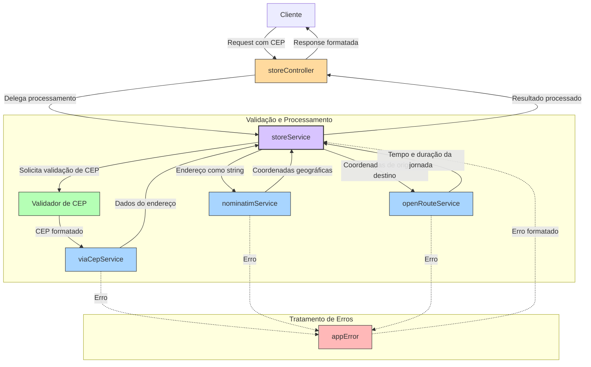

```mermaid
flowchart TD
    A[Cliente] -->|Request com CEP| B[storeController]
    B -->|Delega processamento| C[storeService]
    
    subgraph "Validação e Processamento"
        C -->|Solicita validação de CEP| D[Validador de CEP]
        D -->|CEP formatado| E[viaCepService]
        E -->|Dados do endereço| C
        C -->|Endereço como string| F[nominatimService]
        F -->|Coordenadas geográficas| C
        C -->|Coordenadas de origem e destino| G[openRouteService]
        G -->|Tempo e duração da jornada| C
    end
    
    subgraph "Tratamento de Erros"
        E -.->|Erro| H[appError]
        F -.->|Erro| H
        G -.->|Erro| H
        H -.->|Erro formatado| C
    end
    
    C -->|Resultado processado| B
    B -->|Response formatada| A
    
    classDef services fill:#a8d5ff,stroke:#333,stroke-width:1px
    classDef validators fill:#b5ffb5,stroke:#333,stroke-width:1px
    classDef controllers fill:#ffda9e,stroke:#333,stroke-width:1px
    classDef errors fill:#ffb8b8,stroke:#333,stroke-width:1px
    classDef central fill:#d8c4ff,stroke:#333,stroke-width:2px
    
    class E,F,G services
    class D validators
    class B controllers
    class H errors
    class C central
```